## {.split-40 background-image="../_img/midd/midd-banner-light.jpg" background-size="cover" background-position="center" background-repeat="no-repeat" background-color="white"} 


#### Hi everyone! I'm Phil Chodrow


::: {.column}

<br> <br> 

::: {.textblock}

Prof. of CS at Middlebury College, a small liberal arts college in Vermont.  

:::

::: {.textblock-inverse}

*Students/postdocs: ask me about [**\#LiberalArtsLife**]{.alert} if you're curious.*

:::

::: {.textblock}

I like  aikido, tea, my cats, being outside, math models of social systems, and [hypergraphs]{.alert}. 

:::


:::

::: {.column}

{.absolute left=50 top=120 width=45%}
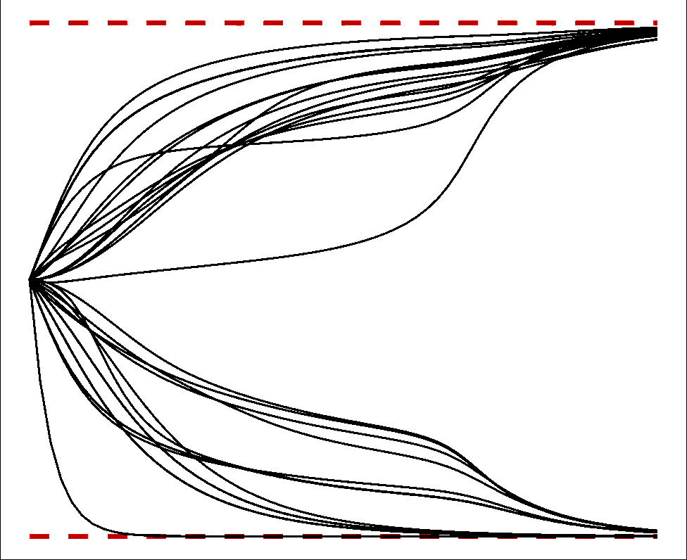{.absolute left=50 top=400 width=45%}
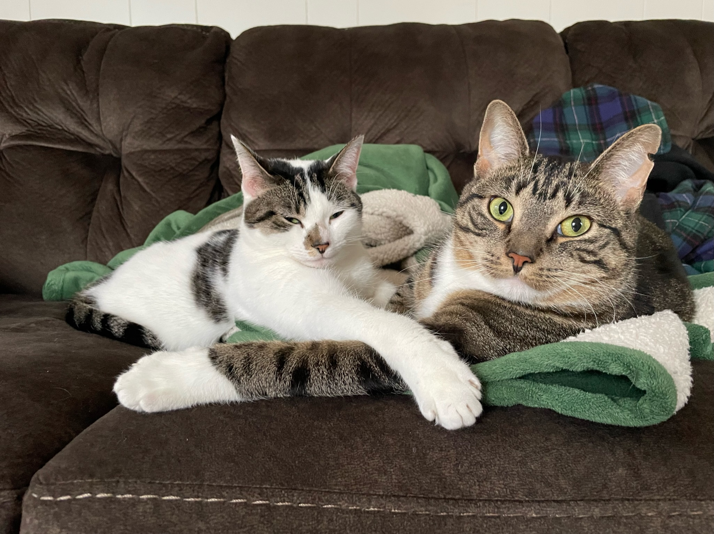{.absolute right=80 top=120 width=25.5%}
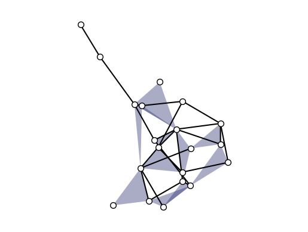{.absolute right=80 top=250 width=25.5%}
{.absolute right=80 top=380 width=25.5%}
{.absolute right=80 top=510 width=25.5%}

::: 

## {.split-50}

#### My Intellectual Journey in Hypergraphs


::: {.column}

<br> <br> <br><br> <br>

```python
network_topics = [
    "configuration models", 
    "directed configuration models",
    "modularity", 
    "spectral clustering", 
    "detectability thresholds"
    ]

for topic in network_topics:
    do_but_for_hypergraphs(topic)
```


[TBH this was a reliable source of low-risk theory problems as I established my career.]{.footnote .fragment fragment-index=2}

:::

::: {.column .fragment fragment-index=1}

<br> <br> 

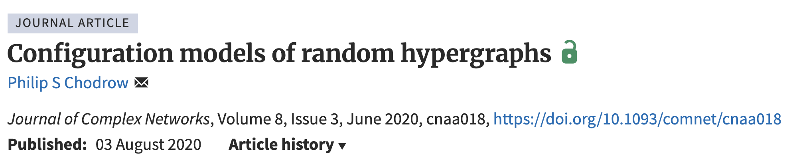

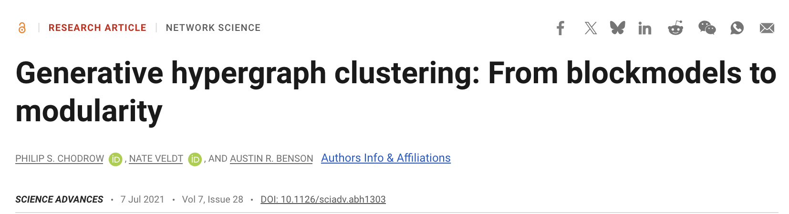


:::

## {.split-50}

### But...

::: {.column}

<br> <br> <br> <br> <br> <br> 

What structures exist in hypergraphs that we can't study in graphs *at all*? 

<br> <br> <br> 

::: {.fragment}

One answer: [two-edge motifs]{.alert}.

:::

:::

::: {.column}

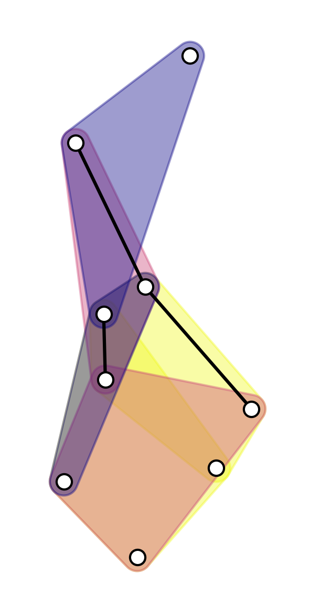{height=600 fig-align="center"}

:::

## 

### 2-edge motifs in (simple) undirected graphs

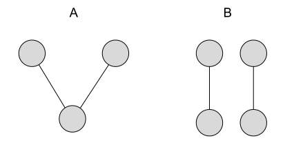


## 

### 2-edge motifs in hypergraphs

**Claim**: *What's special about the structure of hypergraphs is that they have diverse, undirected, two-edge motifs: [**intersections**]{.alert}.* 

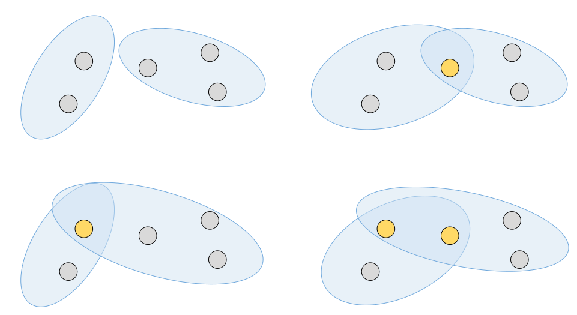{fig-align="center" height=400}


## {.split-40}

#### Intersections in Temporal  Hypergraphs

::: {.column}

<br> 

Let $r_k^{(t)}$ be the probability that two uniformly random hyperedges which arrive before time $t$ have an intersection of size $k$.

In empirical hypergraphs, $r_k^{(t)}$ often decays at rates close to $t^{-1}$ or $t^{-2}$, *regardless of $k$*.  

[Benson, Abebe, Schaub, and Kleinberg (2018). Simplicial closure and higher-order link prediction. *PNAS*<br> <br> Chodrow (2020). Configuration models of random hypergraphs. *JCN* <br><br> Landry, Young, and Eikmeier (2023). The simpliciality of higher-order networks. *EPJ Data Sci.*]{.footnote .absolute bottom=0}  

:::

::: {.column}

<br> 

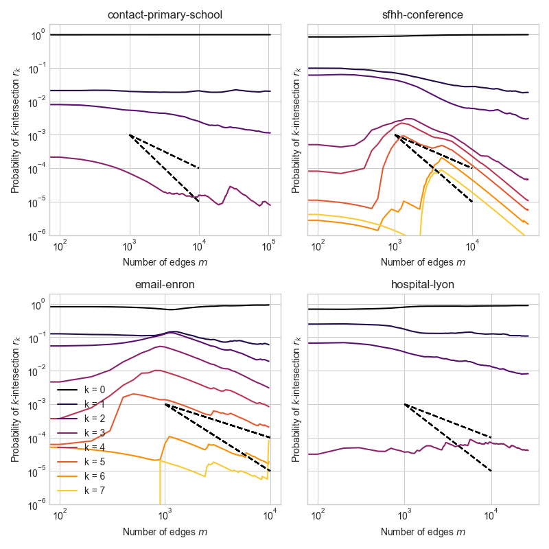{fig-align="center" height=500}


[Dashed lines give slope of $t^{-1}$ and $t^{-2}$ decay.]{.footnote}

:::

## 

::: {.column}

<table style="padding:0px;border-bottom:0pxmargin: 0px auto; ">
<tr style="border:0px;padding:0px;margin:0px;">
<td style="padding:0px;border-bottom:0px"> 
{.portrait-small} 
</td>
<td style="vertical-align: middle;white-space:nowrap;padding:0px;border-bottom:0px">
<p style="padding:0px">**Xie He** <br> Dartmouth + Microsoft</p>
</td>


</tr>

<tr>

<td style="vertical-align: middle;padding:0px;border-bottom:0px"> 
{.portrait-small} 
</td>
<td style="vertical-align: middle;white-space:nowrap;padding:0px;border-bottom:0px">
<p style="padding:0px">**Phil Chodrow** <br> Middlebury</p>
</td>
</tr>
<tr>
<td style="vertical-align: middle;padding:0px;border-bottom:0px"> 
{.portrait-small} 
</td>
<td style="vertical-align: middle;white-space:nowrap;padding:0px;border-bottom:0px">
<p style="padding:0px">**Peter Mucha** <br> Dartmouth</p>
</td>

</tr>

</table>

:::

::: {.column}

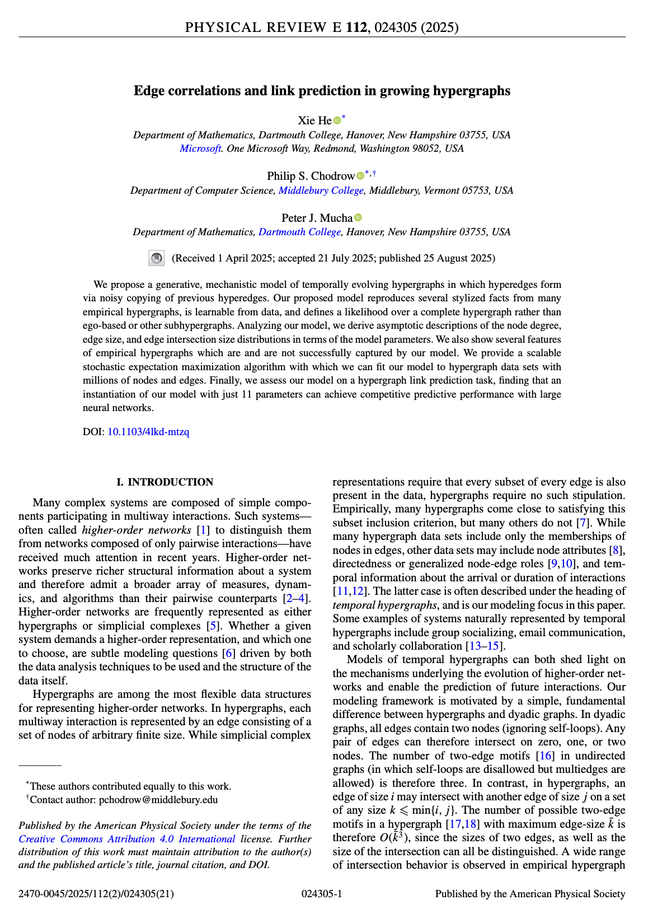

:::


## 

::: {.column}

<table style="padding:0px;border-bottom:0pxmargin: 0px auto; ">
<tr style="border:0px;padding:0px;margin:0px;">
<td style="padding:0px;border-bottom:0px"> 
{.portrait-small} 
</td>
<td style="vertical-align: middle;white-space:nowrap;padding:0px;border-bottom:0px">
<p style="padding:0px">**Xie He** <br> Dartmouth + Microsoft</p>
</td>


</tr>

<tr>

<td style="vertical-align: middle;padding:0px;border-bottom:0px"> 
{.portrait-small} 
</td>
<td style="vertical-align: middle;white-space:nowrap;padding:0px;border-bottom:0px">
<p style="padding:0px">**Phil Chodrow** <br> Middlebury</p>
</td>
</tr>
<tr>
<td style="vertical-align: middle;padding:0px;border-bottom:0px"> 
{.portrait-small} 
</td>
<td style="vertical-align: middle;white-space:nowrap;padding:0px;border-bottom:0px">
<p style="padding:0px">**Peter Mucha** <br> Dartmouth</p>
</td>

</tr>

</table>

:::

::: {.column}


<br> <br> <br> <br> 

### [H]{.alert}e 

### [C]{.alert}hodrow

### [M]{.alert}ucha

:::


## 

::: {.column}

<table style="padding:0px;border-bottom:0pxmargin: 0px auto; ">
<tr style="border:0px;padding:0px;margin:0px;">
<td style="padding:0px;border-bottom:0px"> 
{.portrait-small} 
</td>
<td style="vertical-align: middle;white-space:nowrap;padding:0px;border-bottom:0px">
<p style="padding:0px">**Xie He** <br> Dartmouth + Microsoft</p>
</td>


</tr>

<tr>

<td style="vertical-align: middle;padding:0px;border-bottom:0px"> 
{.portrait-small} 
</td>
<td style="vertical-align: middle;white-space:nowrap;padding:0px;border-bottom:0px">
<p style="padding:0px">**Phil Chodrow** <br> Middlebury</p>
</td>
</tr>
<tr>
<td style="vertical-align: middle;padding:0px;border-bottom:0px"> 
{.portrait-small} 
</td>
<td style="vertical-align: middle;white-space:nowrap;padding:0px;border-bottom:0px">
<p style="padding:0px">**Peter Mucha** <br> Dartmouth</p>
</td>

</tr>

</table>

:::

::: {.column}


<br> <br> <br> <br> 

### [H]{.alert}[yperedge]{.fragment}

### [C]{.alert}[opy]{.fragment}

### [M]{.alert}[odel]{.fragment}

:::


## {.split-50}

#### [H]{.alert}yperedge [C]{.alert}opy [M]{.alert}odel

::: {.column}

<br> <br> <br> 

##### Inspo from...

Benson, Kumar, and Tomkins (2018). "Sequences of Sets." *KDD* 
<br> <br> 
Benson, Abebe, Schaub, and Kleinberg (2018). "Simplicial closure and higher-order link prediction." *PNAS*
<br><br>
Avin, Lotker, Nahum, and Peleg (2019). "Random preferential attachment hypergraph." *ASONAM* 

:::

::: {.column}

<br> 

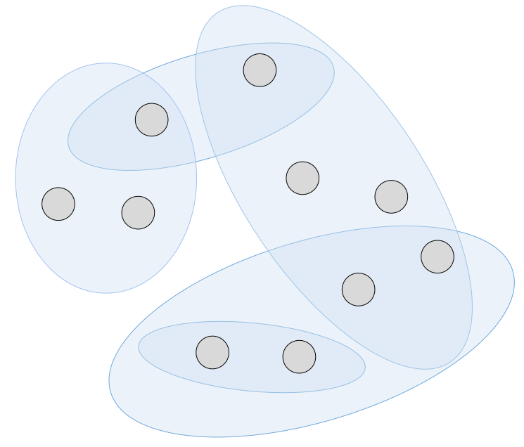

:::


## {.split-30}

#### [H]{.alert}yperedge [C]{.alert}opy [M]{.alert}odel

::: {.column}

<br> <br> <br> 

#### In each timestep...

:::

::: {.column}

<br> 


:::


## {.split-30}

#### [H]{.alert}yperedge [C]{.alert}opy [M]{.alert}odel

::: {.column}

<br> <br> <br> 

#### Select a random edge

:::

::: {.column}

<br> 

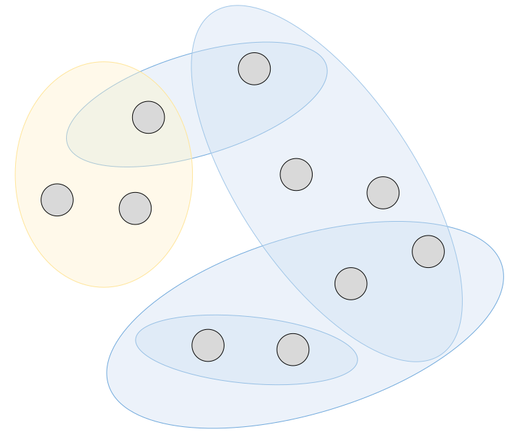

:::

## {.split-30}

#### [H]{.alert}yperedge [C]{.alert}opy [M]{.alert}odel

::: {.column}

<br> <br> <br> 

#### Select random nodes from edge

:::

::: {.column}


<br> 

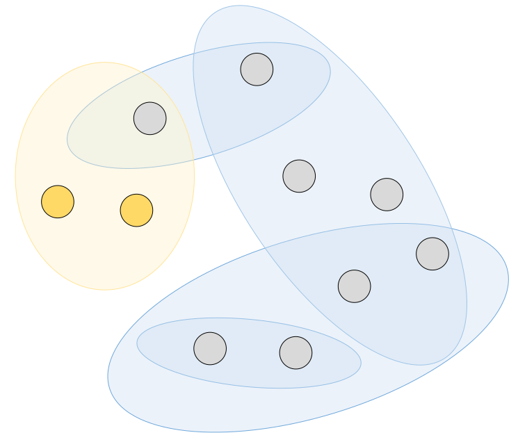

:::

## {.split-30}

#### [H]{.alert}yperedge [C]{.alert}opy [M]{.alert}odel

::: {.column}

<br> <br> <br> 

#### Add nodes from hypergraph

#### Add novel nodes

:::

::: {.column}

<br> 

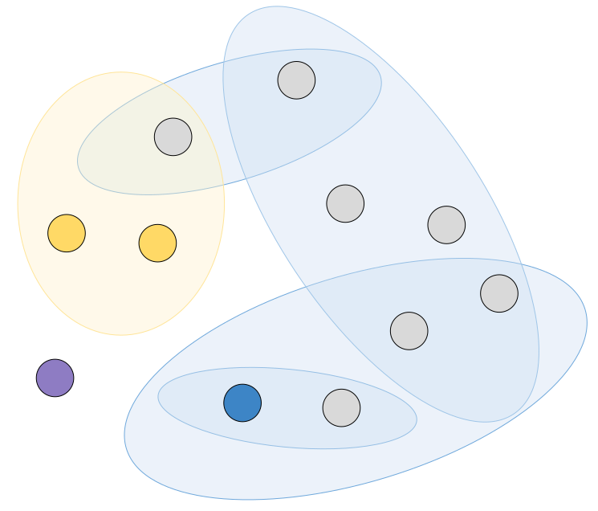

:::

## {.split-30}

#### [H]{.alert}yperedge [C]{.alert}opy [M]{.alert}odel


::: {.column}

<br> <br> <br> 

#### Form edge

:::

::: {.column}

<br> 

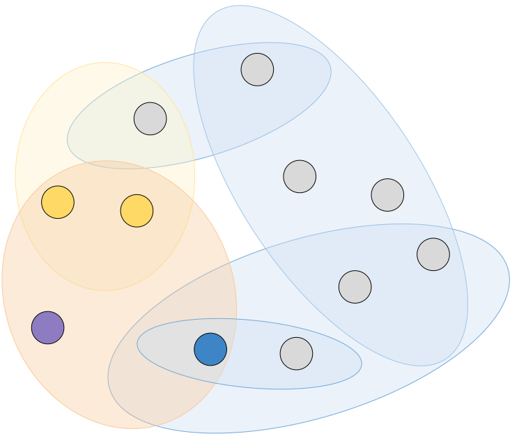

:::

## {.split-30}

#### [H]{.alert}yperedge [C]{.alert}opy [M]{.alert}odel

::: {.column}

<br> <br> <br> 

#### Repeat
 
:::

::: {.column}

<br> 

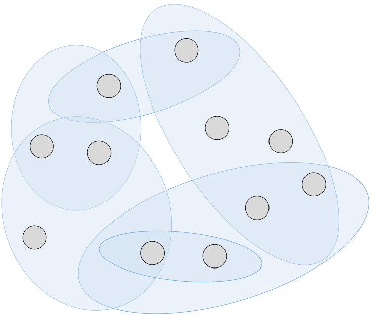

:::


## {.split-30}

#### [H]{.alert}yperedge [C]{.alert}opy [M]{.alert}odel

::: {.column}

<br> <br> <br> 

#### Repeat

:::

::: {.column}

<br> 

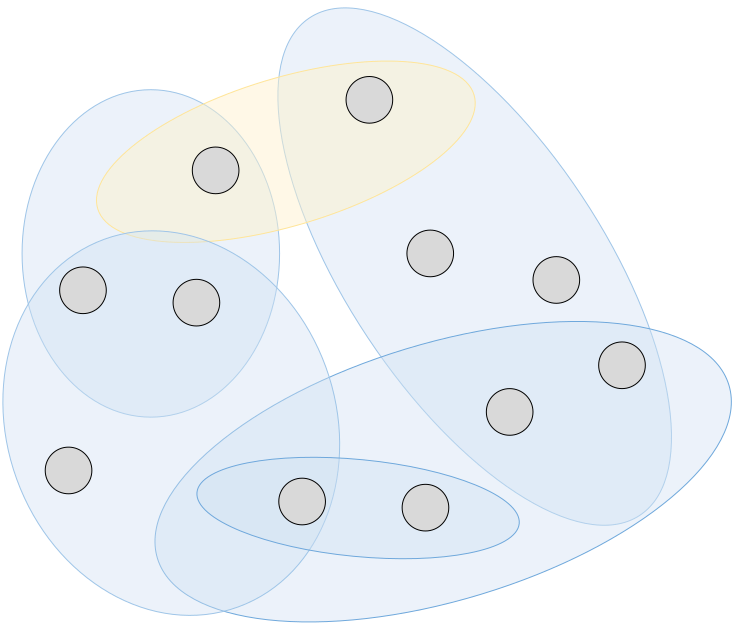

:::

## {.split-30}

#### [H]{.alert}yperedge [C]{.alert}opy [M]{.alert}odel

::: {.column}

<br> 

##### Formally

In each timestep $t$: 

- Start with an empty edge $f = \emptyset$. 
- Select an edge $e \in H$. 
- Accept each node from $e$ into $f$ with probability $\eta$ (condition on at least one).  
- Add $X \sim \boldsymbol{\beta}$ novel nodes. 
- Add $Y \sim \boldsymbol{\gamma}$ nodes from $H \setminus e$. 

:::

::: {.column}

<br> 

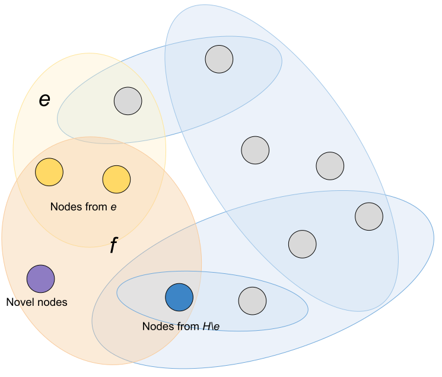

:::


##

#### "Tractable" Asymptotics 


::: {.font_80}

**Proposition** (HCM '25): There exist constants $q_k$ such that, as $t\rightarrow \infty$, 
$$
\begin{aligned}
r_{k}(t) = \text{Rate of $k$-intersections at time $t$}\simeq \begin{cases}
  q_k & \quad \text{if } k = 0\\
  \color{#ff9f1c}{t^{-1}} q_k &\quad \mathrm{otherwise}\;.
\end{cases}
\end{aligned}
$$

Here, $q_k = \sum_{ij} q_{ijk}$ and $\{q_{ijk}\}$ solve the system 

$$
q_{ijk} = \begin{cases}
  \frac{1}{2}\sum_{\ell} \left(q_{\ell j 0} \alpha_{i0|\ell j0} + q_{j \ell 0} \alpha_{i0|j\ell 0}\right) & \quad  k = 0\\
  \frac{1}{2}\beta_{ik|j} \sum_{\ell} (q_{\ell j0} + q_{j\ell 0}) + \frac{1}{2}\sum_{\ell, h\geq k}  \left(q_{\ell j h} \alpha_{ik|\ell jh} + q_{j \ell h} \alpha_{ik|j\ell h}\right) &\quad k \geq 1\;,
\end{cases}
$$

where $\alpha_{ik|\ell jh}$ and $\beta_{ik|j}$ are constants determined by the model parameters. 

:::

[These come out of linearized compartmental equations.]{.footnote}


## 

#### Edge intersections 

**Proposition** (HCM '25): There exist constants $q_k$ such that, as $t\rightarrow \infty$, $r_{k}(t) \simeq \begin{cases} q_k & \quad \text{if } k = k_0\\ \color{#ff9f1c}{t^{-1}} q_k &\quad \mathrm{otherwise}\;. \end{cases}$
<!-- $$
\begin{aligned}

\end{aligned}
$$ -->


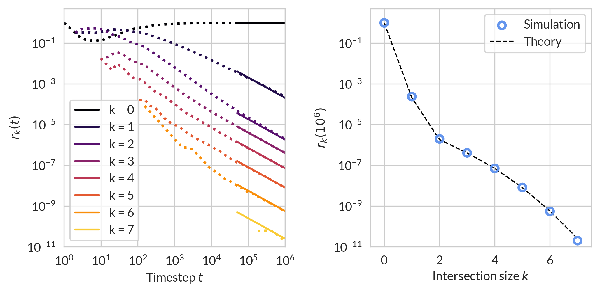{fig-align="center"}

##

#### Degree and edge-size distributions

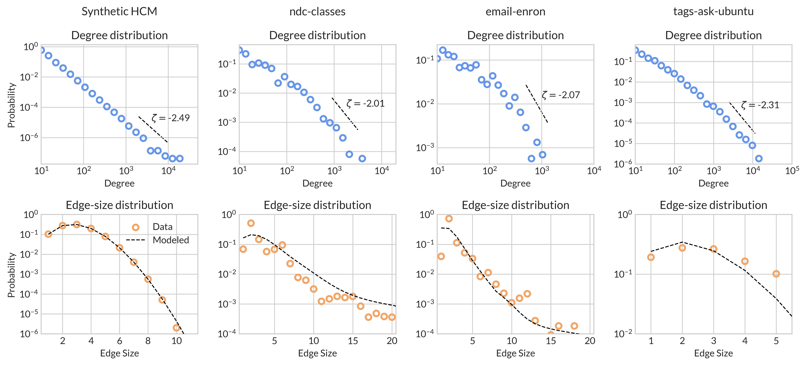{fig-align="center"}

[From statistically-inferred parameters, not regression fits!]{.footnote}


## {.split-50}

#### Scalable online learning via stochastic EM

::: {.column .font_smaller .font_smaller}

<br> <br> 

**Aim**: given the sequence of edges $\{e_t\}$, estimate: 

- $\eta$, the edge retention rate. 
- $\beta$, the distribution of the number of novel nodes added to each edge. 
- $\gamma$, distribution of the number of pre-existing nodes added to each edge. 


1. Sample $e_t$ and form a belief about seed edge $f$.
2. Update a vector of expected sufficient statistics $\theta_t$ and current parameter estimates $\bar{\eta}$, $\bar{\beta}$, and $\bar{\gamma}$. 
4. Repeat until tired. 


:::


::: {.column}

<br> <br> <br> 
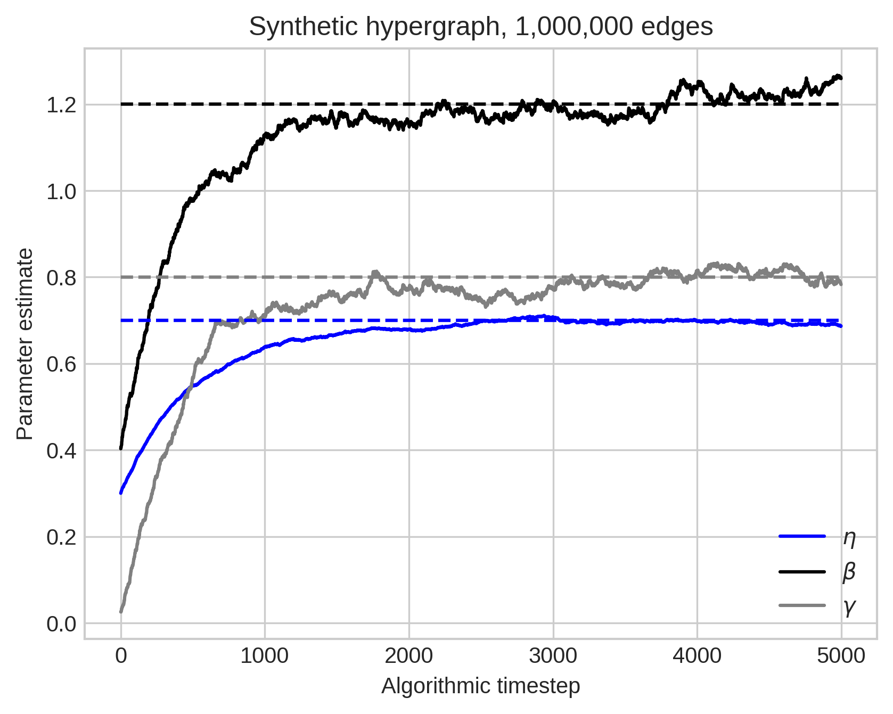{.absolute width=700 left=0}


:::


##

##### Simple models can be predictive!

We computed AUC scores for a link prediction task in which our model learns parameters on 20% training data from three metabolic and organic reaction data sets with edges up to size 5. We compared these against previously-reported AUC scores on the same task for two dedicated **neural** network hypergraph link prediction algorithms. 

[Yadati et al. (2020) NHP: Neural Hypergraph Link Prediction. *CIKM* <br> <br> 
Yang et al. (2023) LHP: Logical hypergraph link prediction. *Expert Systems with Applications*]{.footnote}  


::: {.font_65}

|          	| $n$    	| $m$    	| HCM   | NHP     | LHP       	|
|:----------|--------:|--------:|------------:|--------:|------------:|
| iAF1260b 	| 1,668  	| 2,084  	| 0.605 	    | 0.582  	| **[0.639]{.alert}**   |
| iJO1366  	| 1,805  	| 2,253  	| **[0.774]{.alert}** 	| 0.599  	| 0.638     	|
| USPTO    	| 16,293 	| 11,433 	| 0.515     	| 0.662  	| **[0.733]{.alert}** 	|

:::

We are competitive with  neural networks (on some data sets) using an 11-parameter model!


## {.split-40}

::: {.column}

### Thank you!!

Hypergraphs have interesting two-edge motifs (intersections). **Learnable, mechanistic** models of hypergraph growth can be tractable and predictive.
{height=250}

[Edge correlations and link prediction in growing hypergraphs. He, Chodrow, and Mucha. *Physical Review E* (2025)]{.footnote}

:::

::: {.column}

{.absolute top=80 left=50 .portrait-medium}
[Xie He]{.absolute top=240 left=60}

{.absolute top=80 left=220 .portrait-medium}
[Peter Mucha]{.absolute top=240 left=230}

{.absolute top=80 left=390 .portrait-medium}

<br> <br> <br> <br> 

::: {.fragment}

##### Community structure??

<br> 

::: {.textblock}

{.absolute top=330 left=50 .portrait-medium}
[[**Violet Ross**]{.alert} (CU Boulder)]{.absolute top=410 left=200}

<br> <br> 

*Modeling Homophilic Hypergraph Growth Using Edge Copying* (#201)

Wednesday \@4:45pm in Central Square

:::

:::

:::


