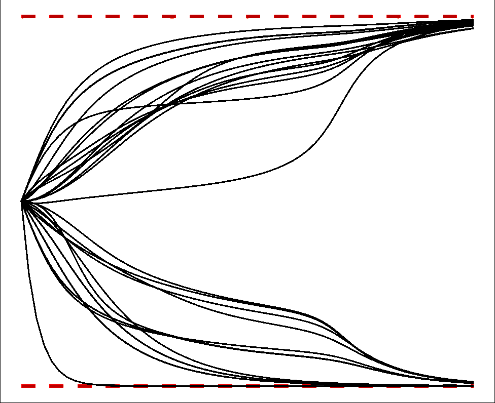
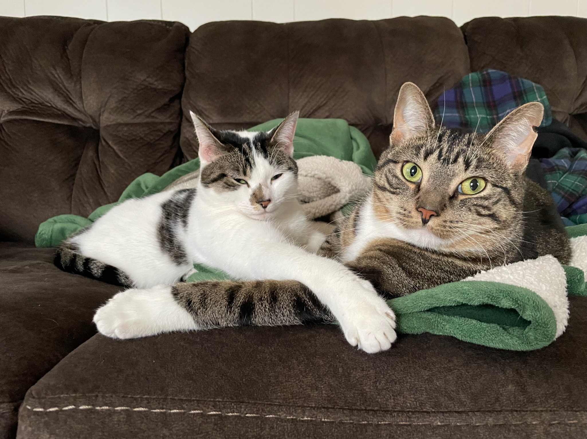
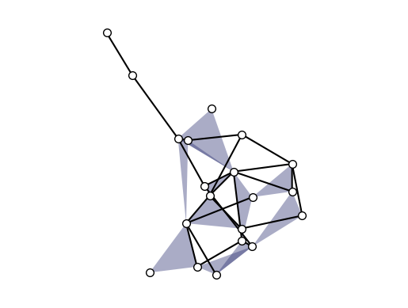
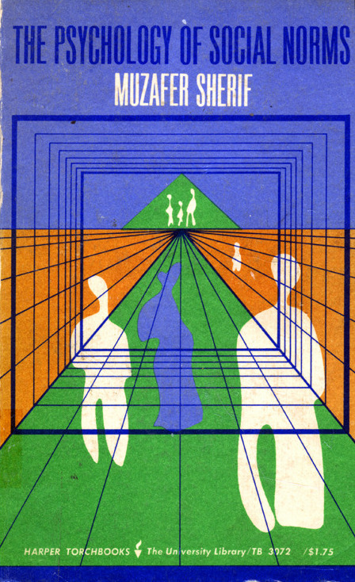
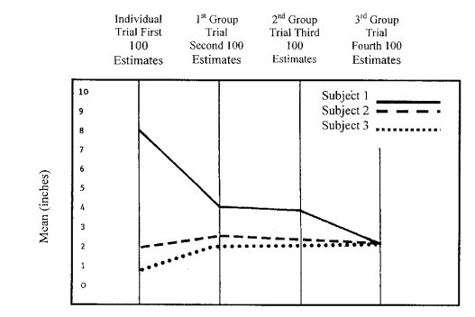
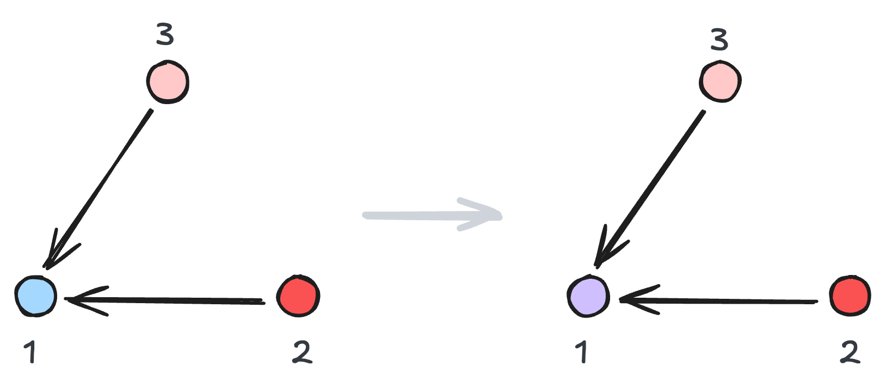
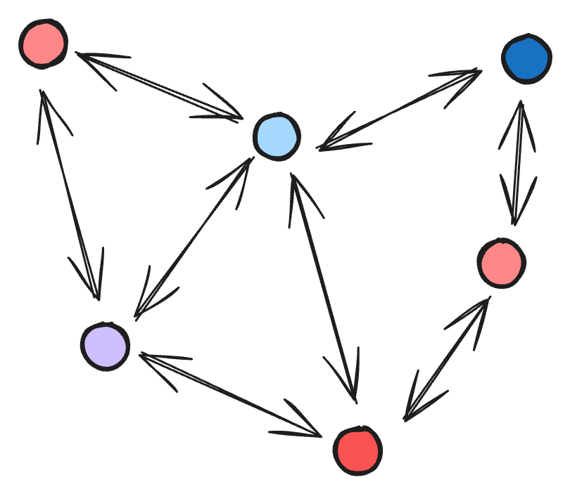

## {.split-40 background-image="../_img/midd/midd-banner-light.jpg" background-size="cover" background-position="center" background-repeat="no-repeat"} 


#### Hi everyone! I'm Phil Chodrow


::: {.column}

<br> <br> 

::: {.textblock}

Prof. of CS at Middlebury College, a small liberal arts college in Vermont.  

:::

::: {.textblock-inverse}

*Students/postdocs: ask me about [**\#LiberalArtsLife**]{.alert} if you're curious.*

:::

::: {.textblock}

I like  aikido, tea, my cats, being outside, hypergraphs, and [math models of social systems]{.alert}. 

:::


:::

::: {.column}

{.absolute left=50 top=120 width=45%}
{.absolute left=50 top=400 width=45%}
{.absolute right=80 top=120 width=25.5%}
{.absolute right=80 top=250 width=25.5%}
{.absolute right=80 top=380 width=25.5%}
{.absolute right=80 top=510 width=25.5%}

::: 

## {.split-50}

### Social Influence...

::: {.column}

<br> <br> 

Goes back at least as far as 1936. 

:::

::: {.column}

{.absolute top=0 left=0 width="100%" height="100%"}

:::

## {background-color="black"}

<br> <br> <br> <br> <br> <br> <br> <br> <br> 

::: {.r-stack}

::: {data-id="box1" style="background: #ffffff; width: 10px; height: 10px; border-radius: 200px;"}

:::

<!--  -->

:::

## 



## 

#### Abstracting Social Influence

Let $x_i(t) \in \mathbb{R}$ be the opinion of agent $i$ at time $t$. 

{height=2.5in  fig-align="center"}

$$
\begin{aligned}
    \underbrace{\color{#d0bfff}{x_1}(t+1) - \color{#a5d8ff}{x_1}(t)}_{\text{opinion change } \delta_i(t+1)} = \overbrace{\lambda}^{\text{Learning rate}} \underbrace{\frac{\color{#fa5252}{x_2}(t) + \color{#ffc9c9}{x_3}(t)}{2}}_{\text{average opinion of neighbors}}
\end{aligned}
$$


## {.split-40}


#### More generally, 

::: {.column}

<br><br><br>

{width="100%"}

[DeGroot (1974). "Reaching a consensus." *JASA*]{.footnote}

:::


::: {.column}

<br><br><br><br><br>

Let $\partial i$ be the set of neighbors of agent $i$. 

$$
\begin{aligned}
    \underbrace{x_i(t+1) - x_i(t)}_{\text{opinion change } \delta_i(t+1)} &= \lambda \underbrace{\frac{1}{|\partial i|}\sum_{j \in \partial i} x_j(t)}_{\text{average opinion of neighbors}} \\ 
\end{aligned}
$$

:::


## {.split-50}

#### A realistic model?

::: {.column}

<br><br>


:::

::: {.column}

<br><br><br>

```{r}
#| echo: false
#| fig.width: 6
#| fig.height: 4

library(tidyverse)

x = c(0.5, 2, 8)
A = matrix(c(0, 1, 1,
             1, 0, 1,
             1, 1, 0), nrow=3, byrow=TRUE)
lambda = 0.5

df = tibble(t = 0, agent = 1:3, opinion = x)
for(t in 1:3){
  x = x + 0.5 * (A %*% x / rowSums(A) - x)
  df = bind_rows(df, tibble(t=t, agent=1:3, opinion=x))
}

df |> ggplot() +
  geom_line(data=df, aes(x=t, y=opinion, linetype=factor(agent)), size=1.5) +
#   scale_color_manual(values=c("#d0bfff", "#fa5252", "#ffc9c9")) +
  theme_minimal() +
  theme(legend.position="none") +
  labs(x="Model timestep", y="Opinion") + 
  scale_y_continuous(limits=c(0, 10)) +
  scale_linetype_manual(values=c("dotted", "dashed", "solid")) + 
  ggtitle("DeGroot (1974) model")
```

:::

<br> <br> <br> <br> <br> <br> <br> <br> <br> <br> <br> <br>

On a connected social graph where all agents listen (at least a little bit) to all their neighbors, DeGroot dynamics always converge to a consensus. 

## {background-image="../_img/kernel-inference/polarized-report.png" background-size="contain" background-position="center" background-repeat="no-repeat"}


## 

#### Generalizing with Influence Kernels

::: {.column}

$$
\begin{aligned}
    \delta_i(t+1) &= x_i(t+1) - x_i(t) \\
    &= \lambda \frac{1}{|\partial i|}\sum_{j \in \partial i} x_j(t)   \quad \quad (\text{DeGroot})
\end{aligned}
$$

{fig-align="center" height=30}

$$
\begin{aligned}
    \delta_i(t+1) &= x_i(t+1) - x_i(t) \\
    &=  \lambda \frac{\sum_{j \in \partial i} \color{#A4303F}{K(x_j(t) - x_i(t))} x_j(t)}{\sum_{j \in \partial i} \color{#A4303F}{K(x_j(t) - x_i(t))}}
\end{aligned}
$$

:::

::: {.column}

<br> <br> <br> 

- *Attraction*: $K(x_j - x_i) > 0$
- *Repulsion*: $K(x_j - x_i) < 0$
- *Indifference*: $K(x_j - x_i) = 0$

We recover DeGroot dynamics if $K(y) \equiv 1$.

:::


## References
::: {#refs}
:::