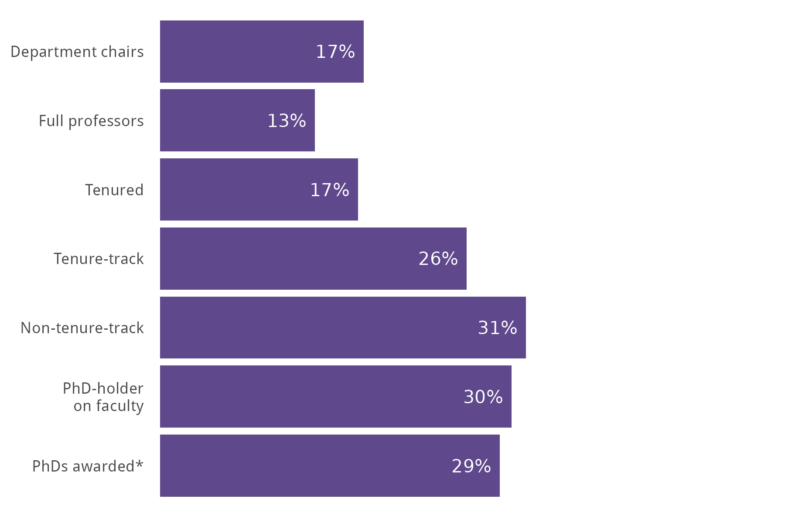
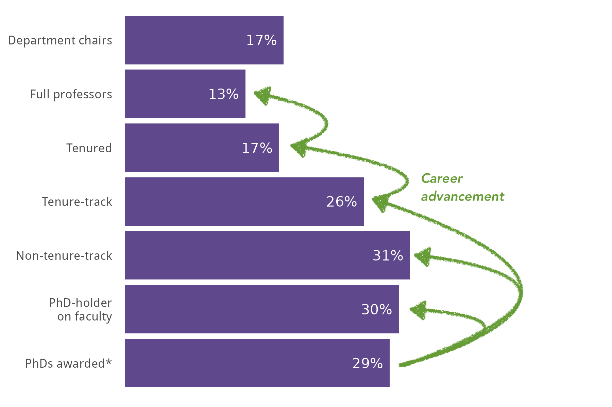
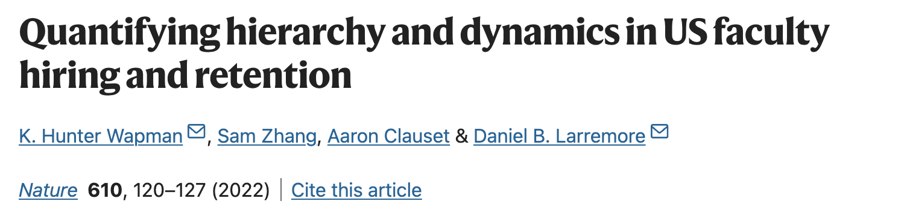
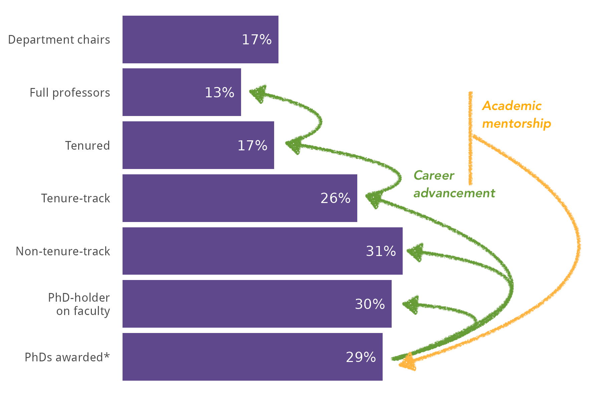
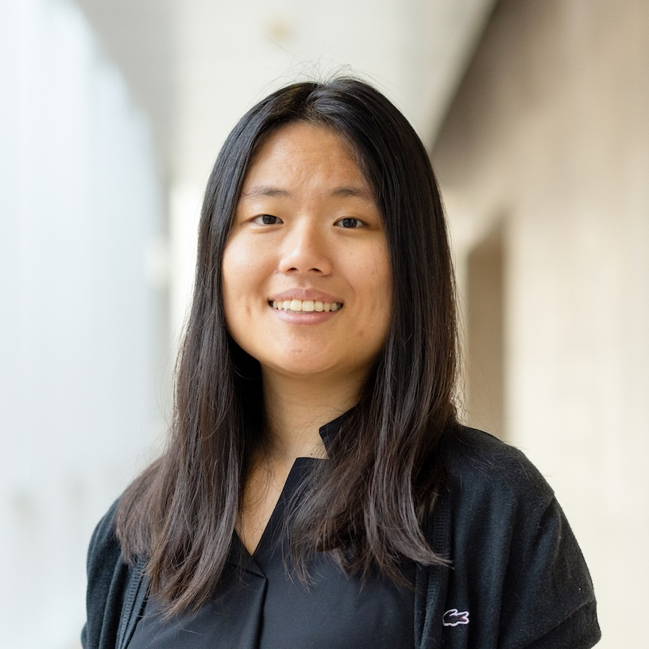
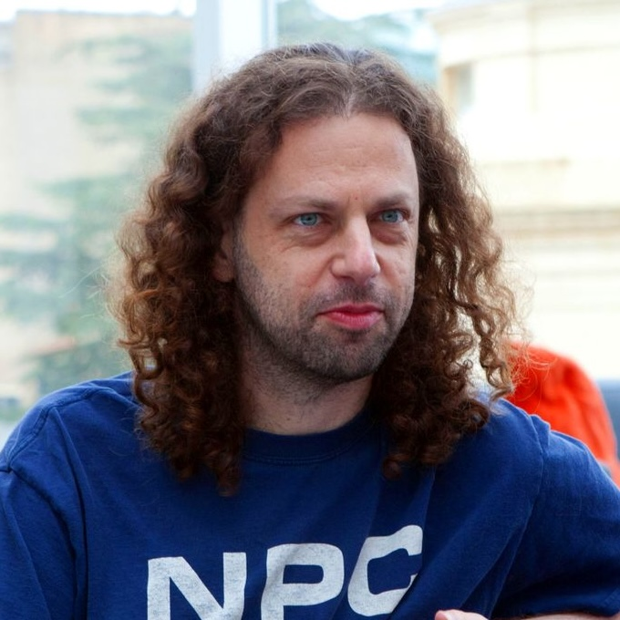
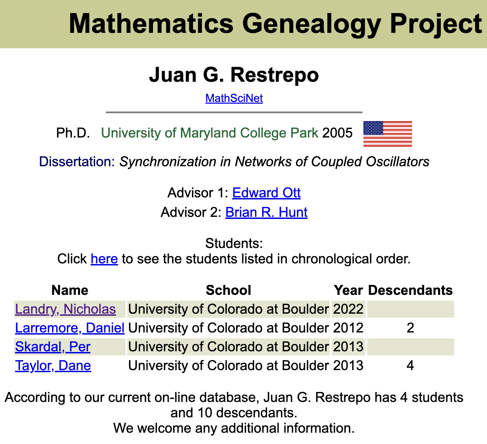
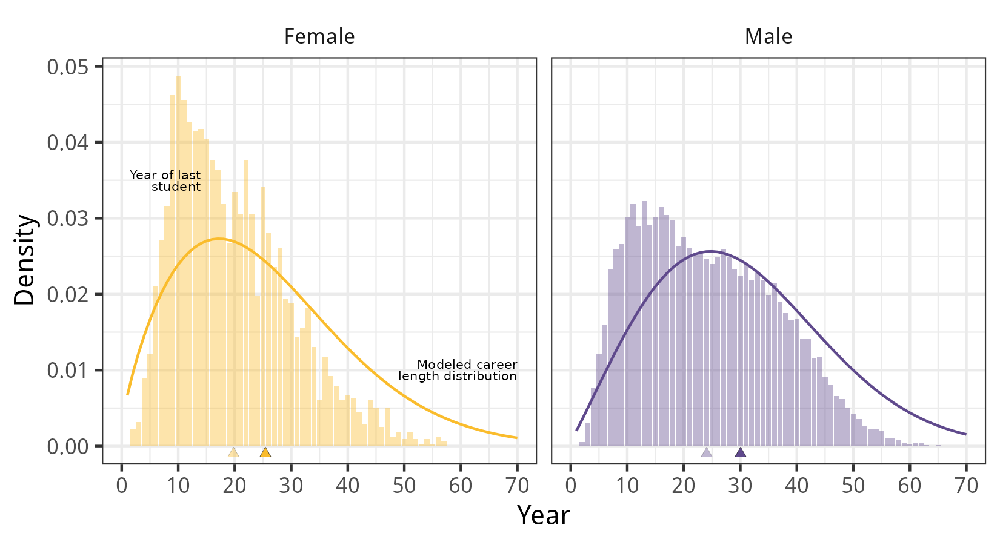

## {.split-50 background-image="../img/midd/midd-banner-light.jpg" background-size="cover" background-position="center" background-repeat="no-repeat"} 

#### Hi everyone! I'm Phil Chodrow

::: {.column}

    

::: {.textblock .fragment}

New-ish professor of CS at Middlebury College, a small liberal arts college in Vermont.  

:::

::: {.textblock-inverse .fragment}

*Students/postdocs: ask me about [**\#LiberalArtsLife**]{.alert} if you're curious.*

:::

::: {.textblock .fragment}

PhD: Operations Research at MIT

Postdoc: Math at UCLA (with Mason Porter)

:::

:::

::: {.column}

    

::: {.textblock-inverse .fragment}

#### *I work on...*

- Higher-order networks, hypergraphs
- Math models of social systems
- Misc. data science

#### *I teach...*

- Machine learning
- Network science
- Discrete math

:::

::: 

                                

## {.split-50 background-image="../img/midd/midd-banner-light.jpg" background-size="cover" background-position="center" background-repeat="no-repeat"} 

#### Also: *aikido, hiking, cycling, tea, chess, gardening, reading, cats*

{.absolute left=50 top=150 width=27%}

{.absolute left=450 top=130 width=29%}

{.absolute left=150 bottom=10 width=30%}

{.absolute right=200 bottom=50 width=30%}

{.absolute right=50 bottom=300 width=20%}

## 

#### Gender Representation in Academic Math

{.absolute left=0 top=100 width=80% align=left}

::: {.absolute right=50 top=90 width=40% align=right}

Data from the [**2020**]{.alert-3} AMS Departmental Profile 🤦🏻‍♂️

                        

[*\*Actually this one is from 2017-2018 (Report on New Doctorates)* 🤦🏻‍♂️🤦🏻‍♂️🤦🏻‍♂️]{.fragment}

:::

## 

#### Much Work (Including From Here!)

{.absolute left=0 top=100 width=80% align=left}

{.absolute right=0 top=100 width=30% align=right}

{.absolute right=0 top=200 width=30% align=right}

{.absolute right=0 top=300 width=30% align=right}

{.absolute width=30% top=400 right=0}

{.absolute width=30% top=500 right=0}

## 

#### Focus For Today

{.absolute left=0 top=100 width=80% align=left}

## 

#### The Team

<table style="padding:0px;border-bottom:0pxmargin: 0px auto; ">
<tr style="border:0px;padding:0px;margin:0px;">
<td style="padding:0px;border-bottom:0px"> 
{.portrait-small} 
</td>
<td style="vertical-align: middle;white-space:nowrap;padding:0px;border-bottom:0px">

**Heather Brooks**   Harvey Mudd

</td>

<td style="vertical-align: middle;padding:0px;border-bottom:0px"> 
{.portrait-small} 
</td>
<td style="vertical-align: middle;white-space:nowrap;padding:0px;border-bottom:0px">

**Harlin Lee**   UNC Chapel Hill

</td>

</tr>

<tr>

<td style="vertical-align: middle;padding:0px;border-bottom:0px"> 
{.portrait-small} 
</td>
<td style="vertical-align: middle;white-space:nowrap;padding:0px;border-bottom:0px">

**Mason Porter**   UCLA

</td>

<td style="vertical-align: middle;padding:0px;border-bottom:0px"> 
{.portrait-small} 
</td>
<td style="vertical-align: middle;white-space:nowrap;padding:0px;border-bottom:0px">

**Juan G. Restrepo**   CU Boulder

</td>

</tr>

<tr>
<td style="vertical-align: middle;padding:0px;border-bottom:0px"> 
{.portrait-small} 
</td>
<td style="vertical-align: middle;white-space:nowrap;padding:0px;border-bottom:0px">

**Anna Haensch**   Tufts

</td>

<td style="vertical-align: middle;padding:0px;border-bottom:0px"> 
{.portrait-small} 
</td>
<td style="vertical-align: middle;white-space:nowrap;padding:0px;border-bottom:0px">

**Phil Chodrow**   Middlebury

</td>

</tr>

</table>

## {.split-50}

### Our Data

::: {.column}

   

:::

::: {.column}

{.absolute left=50 top=20 width=80%}
{.absolute left=250 top=20}

{.absolute width=40% top=300}

[Ben Brill, UCLA '22]{.absolute width=30% top=350 left=300}

[Total of 116,306 advisor-student pairs in the US since 1950, representing 21,781 distinct advisors. 
We observe or estimate math subfields for 94% of these pairs (predictions based on thesis titles). 
We estimate gender for 95% of PhD students and 97% of advisors. ]{.footnote}

:::

## {background-image="../img/mgp/tree.png" background-size="contain" background-position="center" background-repeat="no-repeat"}

## {background-image="../img/mgp/basic-counts-and-trajectories.png" background-size="contain" background-position="center" }

##

### First Model: PhD Production

::: {.textblock}

What gendered differences exist in the *PhD production power* of advisors?

:::

  

{fig-align="center"}

##

##### Men have estimated careers ~4 years longer (on average)

:::{.textblock-vertical .fragment .absolute right=20 top=220}

[**Attrition**]{.alert}

*Addressing disparities in career attrition for female faculty would help to close the gender gap.* 

:::

[   Qualitative match to Barrett-Walker et al. (2023).]{.footnote}

## 

##### Longer careers $\times$ more students per year = more students per career

{fig-align="center"}

:::{.textblock-vertical .fragment .absolute right=20 top=220}

Hypothesis: greater student production per year by male advisors reflects unequal access to research resources; cf. Zhang et al. (2022)

:::

##

### Logistic model for advisee gender

Estimate the odds that the next student produced by an advsior is female based on subfield, advisor gender, and representation of women in advisor group and subfield.

$$
\begin{aligned}
  \log (\text{odds F}) = & \beta_0 \;+ &\quad \beta_0 &= -2.14 \; (0.04)\\ 
                         & \rho \times (\text{advisor is F}) \;+ &\quad\rho &= \phantom{-}0.42 \;(0.02)\\
                         & \gamma \times (\text{proportion F advisees in group}) \;+ &\quad \gamma &= \phantom{-}1.16\; (0.06)\\ 
                         & \eta \times (\text{proportion F in subfield})  &\quad \eta &= \phantom{-}3.27 \; (0.12)\\ 
\end{aligned}
$$  

*We tried a lot of more complex models; this one had best validation AUC.* 

<table>

<tr>
<td style="padding:0.5rem;border-bottom:0px">

:::{.textblock-vertical .fragment  fragment-index=1}

[**Mentorship**]{.alert}

*Female advisors are more effective in attracting or retaining female graduate students.*
:::

</td>
<td style="padding:0.5rem;border-bottom:0px">

:::{.textblock-vertical .fragment fragment-index=1}

[**Belonging**]{.alert }

*Greater representation in the grad student community attracts women to programs and subfields.*

:::

</td>

</tr>

</table>

## {.split-40}

::: {.column}

##### Homophily effects: advisor-student and student-student

Both the gender of a students' specific advisor *and* the overall proportion of female advisors in the subfield's population contribute to the likelihood that the student is female. 

*High uncertainty in the model predictions for large $p_F$ reflects the fact that we have very little data in that region.* 

:::

::: {.column}

   

{.absolute top=100 right=50 width=140%}

:::
