## {.split-40 background-image="../_img/midd/midd-banner-light.jpg" background-size="cover" background-position="center" background-repeat="no-repeat"} 

#### Hi everyone! I'm Phil Chodrow

::: {.column}

    

::: {.textblock}

Prof. of CS at Middlebury College, a small liberal arts college in Vermont.  

:::

::: {.textblock-inverse}

*Students/postdocs: ask me about [**\#LiberalArtsLife**]{.alert} if you're curious.*

:::

::: {.textblock}

I like  aikido, tea, my cats, being outside, hypergraphs, and [math models of social systems]{.alert}. 

:::

:::

::: {.column}

{.absolute left=50 top=120 width=45%}
{.absolute left=50 top=400 width=45%}
{.absolute right=80 top=120 width=25.5%}
{.absolute right=80 top=250 width=25.5%}
{.absolute right=80 top=380 width=25.5%}
{.absolute right=80 top=510 width=25.5%}

::: 

## 

#### Gender Representation in Academic Math

{.absolute left=0 top=100 width=80% align=left}

::: {.absolute right=50 top=90 width=40% align=right}

Data from the [**2020**]{.alert-3} AMS Departmental Profile 🤦🏻‍♂️

                        

*\*Actually this one is from 2017-2018 (Report on New Doctorates)* 🤦🏻‍♂️🤦🏻‍♂️🤦🏻‍♂️

:::

## 

#### Career *advancement* shapes the ecosystem

{.absolute left=0 top=100 width=80% align=left}

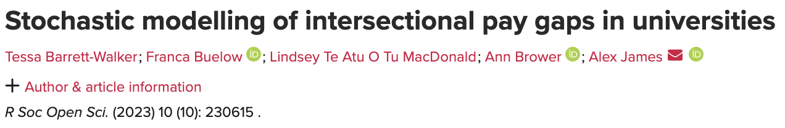{.absolute right=0 top=100 width=30% align=right}

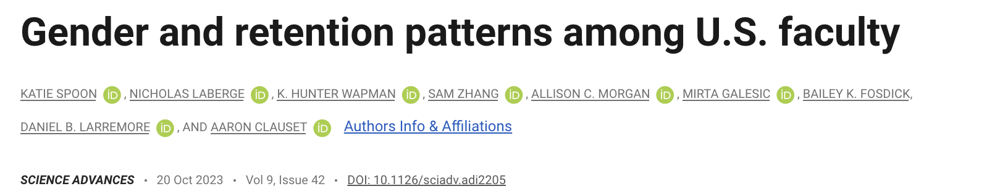{.absolute right=0 top=200 width=30% align=right}

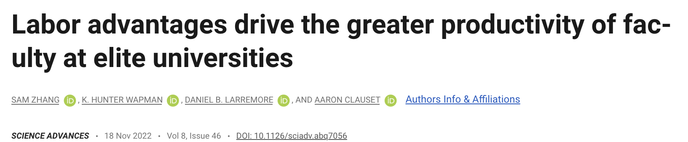{.absolute right=0 top=300 width=30% align=right}

{.absolute width=30% top=400 right=0}

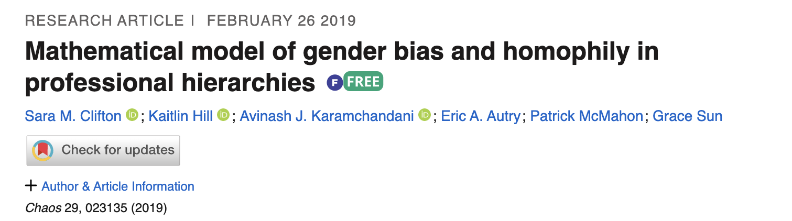{.absolute width=30% top=500 right=0}

## 

#### But so does mentorship!

{.absolute left=0 top=100 width=80% align=left}

## 

#### The Team

<table style="padding:0px;border-bottom:0pxmargin: 0px auto; ">
<tr style="border:0px;padding:0px;margin:0px;">
<td style="padding:0px;border-bottom:0px"> 
{.portrait-small} 
</td>
<td style="vertical-align: middle;white-space:nowrap;padding:0px;border-bottom:0px">

**Heather Brooks**   Harvey Mudd

</td>

<td style="vertical-align: middle;padding:0px;border-bottom:0px"> 
{.portrait-small} 
</td>
<td style="vertical-align: middle;white-space:nowrap;padding:0px;border-bottom:0px">

**Harlin Lee**   UNC Chapel Hill

</td>

</tr>

<tr>

<td style="vertical-align: middle;padding:0px;border-bottom:0px"> 
{.portrait-small} 
</td>
<td style="vertical-align: middle;white-space:nowrap;padding:0px;border-bottom:0px">

**Mason Porter**   UCLA

</td>

<td style="vertical-align: middle;padding:0px;border-bottom:0px"> 
{.portrait-small} 
</td>
<td style="vertical-align: middle;white-space:nowrap;padding:0px;border-bottom:0px">

**Juan G. Restrepo**   CU Boulder

</td>

</tr>

<tr>
<td style="vertical-align: middle;padding:0px;border-bottom:0px"> 
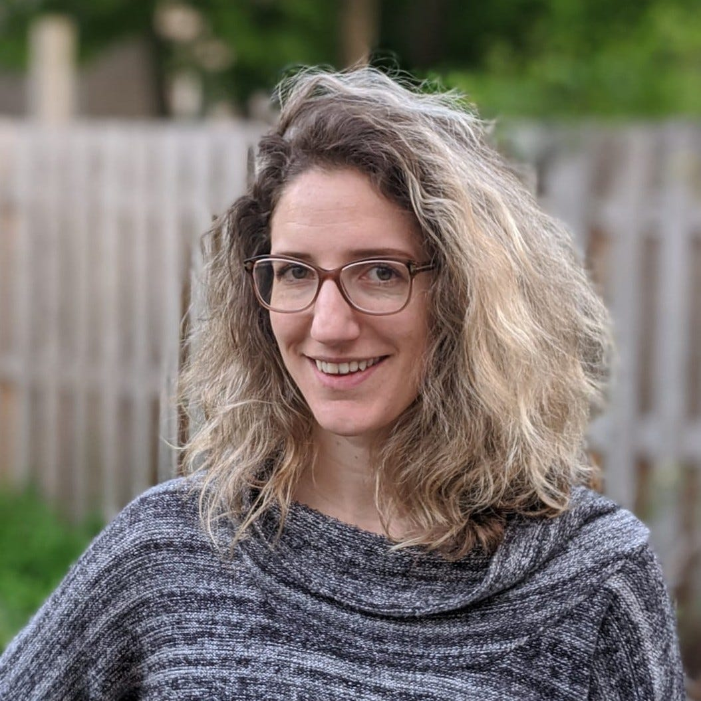{.portrait-small} 
</td>
<td style="vertical-align: middle;white-space:nowrap;padding:0px;border-bottom:0px">

**Anna Haensch**   Tufts

</td>

<td style="vertical-align: middle;padding:0px;border-bottom:0px"> 
{.portrait-small} 
</td>
<td style="vertical-align: middle;white-space:nowrap;padding:0px;border-bottom:0px">

**Phil Chodrow**   Middlebury

</td>

</tr>

</table>

## {.split-50}

### Our Data

::: {.column}

   

:::

::: {.column}

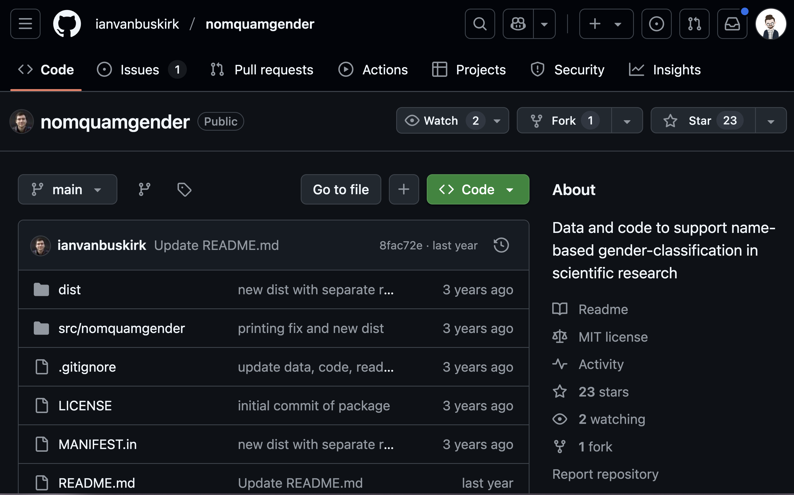{.absolute left=50 top=20 width=80%}
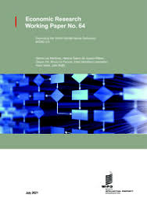{.absolute left=250 top=20}

{.absolute width=40% top=300}

[Ben Brill, UCLA '22]{.absolute width=30% top=350 left=300}

[Total of 116,306 advisor-student pairs in the US since 1950, representing 21,781 distinct advisors. 
We observe or estimate math subfields for 94% of these pairs (predictions based on thesis titles). 
We estimate gender for 95% of PhD students and 97% of advisors. ]{.footnote}

:::

## {background-image="../_img/mgp/tree.png" background-size="contain" background-position="center" background-repeat="no-repeat"}

## {background-image="../_img/mgp/basic-counts-and-trajectories.png" background-size="contain" background-position="center" }

##

### Modeling Gendered PhD Production by an Advisor

  

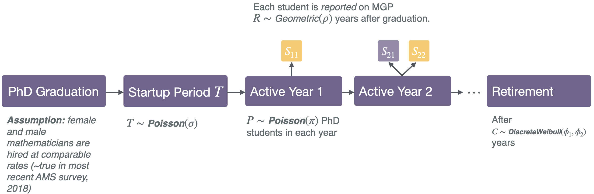{fig-align="center"}

##

##### Men have estimated careers ~4 years longer (on average)

:::{.textblock-vertical .fragment .absolute right=20 top=220}

[**Attrition**]{.alert}

*Addressing disparities in career attrition for female faculty would help to close the gender gap.* 

:::

[   Qualitative match to Barrett-Walker et al. (2023).]{.footnote}

## 

##### Longer careers $\times$ more students per year = more students per career

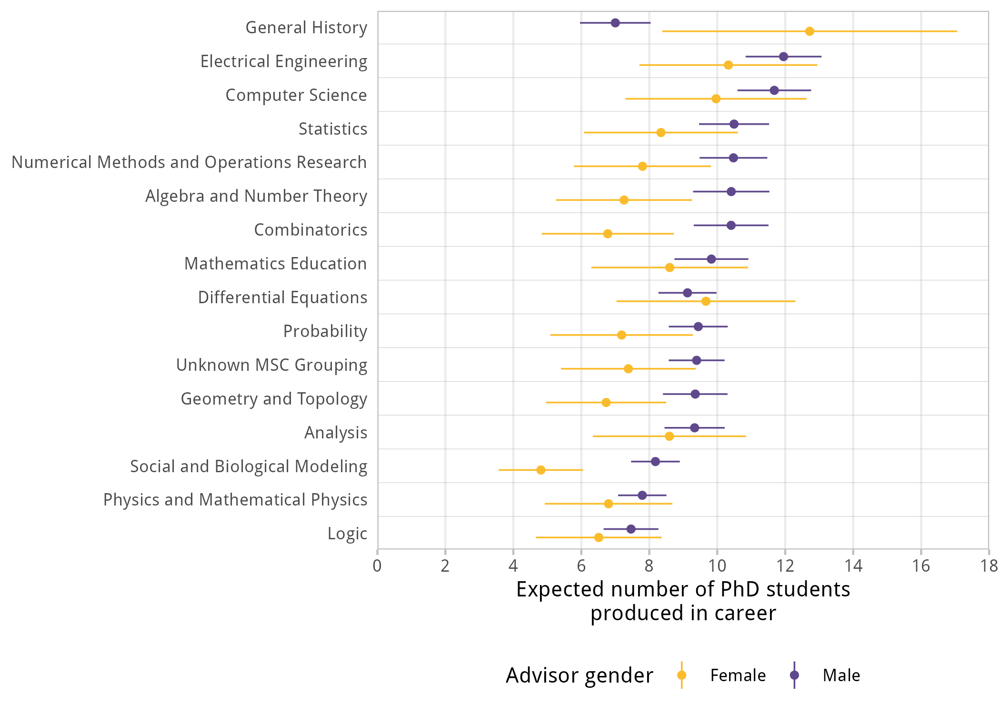{fig-align="center"}

:::{.textblock-vertical .fragment .absolute right=20 top=220}

Hypothesis: greater student production per year by male advisors reflects unequal access to research resources; cf. Zhang et al. (2022)

:::

##

### Logistic model for advisee gender

Estimate the odds that the next student produced by an advsior is female based on subfield, advisor gender, and representation of women in advisor group and subfield.

$$
\begin{aligned}
  \log (\text{odds F}) = & \beta_0 \;+ &\quad \beta_0 &= -2.14 \; (0.04)\\ 
                         & \rho \times (\text{advisor is F}) \;+ &\quad\rho &= \phantom{-}0.42 \;(0.02)\\
                         & \gamma \times (\text{proportion F advisees in group}) \;+ &\quad \gamma &= \phantom{-}1.16\; (0.06)\\ 
                         & \eta \times (\text{proportion F in subfield})  &\quad \eta &= \phantom{-}3.27 \; (0.12)\\ 
\end{aligned}
$$  

*We tried a lot of more complex models; this one had best validation AUC.* 

<table>

<tr>
<td style="padding:0.5rem;border-bottom:0px">

:::{.textblock-vertical .fragment  fragment-index=1}

[**Mentorship**]{.alert}

*Female advisors are more effective in attracting or retaining female graduate students.*
:::

</td>
<td style="padding:0.5rem;border-bottom:0px">

:::{.textblock-vertical .fragment fragment-index=1}

[**Belonging**]{.alert }

*Greater representation in the grad student community attracts women to programs and subfields.*

:::

</td>

</tr>

</table>

## {.split-40}

##### Homophily effects: advisor-student and student-student

::: {.column}

         

Both the gender of a students' specific advisor *and* the overall proportion of female advisors in the subfield's population contribute to the likelihood that the student is female. 

:::

::: {.column}

      

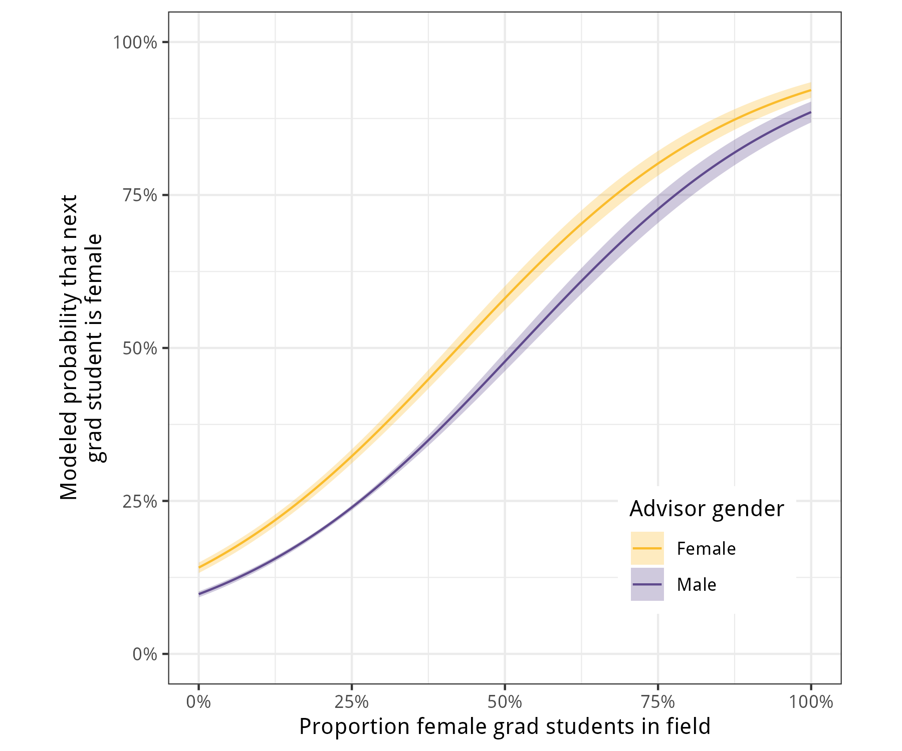{.absolute top=120 right=50 width=140%}

:::

## {.split-40}

#### Modeling Interventions on Medium Timescales: Hiring

::: {.column}

::: {.textblock  .absolute left=20 top=250 style="background-color:#5c5c5c;"}

[**Equal hiring rates**]{.alert} 

Suggested in most recent AMS survey data.

:::

::: {.textblock .fragment .fade-in-then-out .absolute left=20 top=250  fragment-index=1}

[**Male-biased hiring**]{.alert}

Men 20% more likely than women to be hired as faculty. 

:::

::: {.textblock-inverse .fragment .fade-in .absolute left=20 top=250  fragment-index=2}

[**Female-biased hiring**]{.alert}

Women 20% more likely than men to be hired as faculty.

:::

:::

::: {.column}

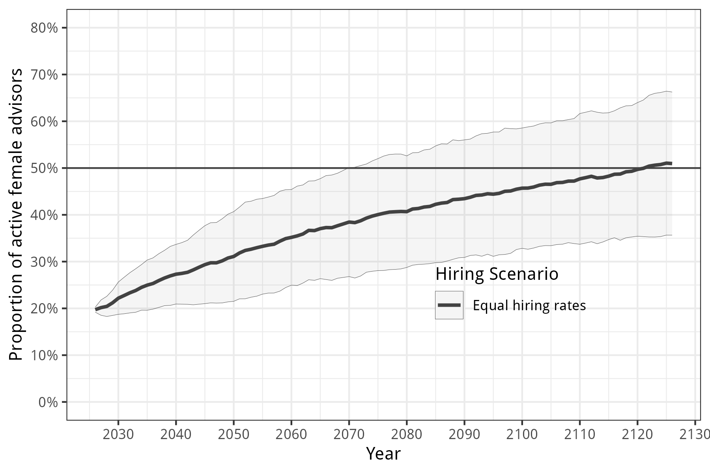{.absolute top=160 right=50 width=100%}

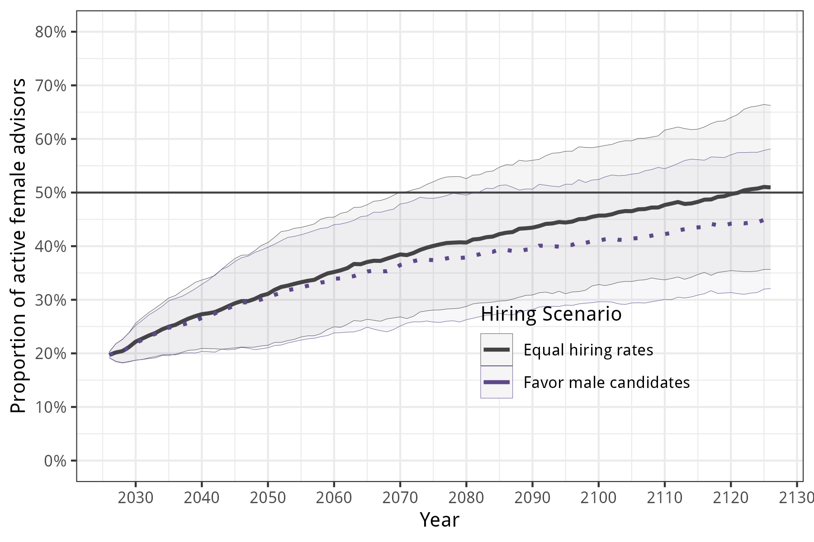{.absolute top=160 right=50 width=100% .fragment fragment-index=1}

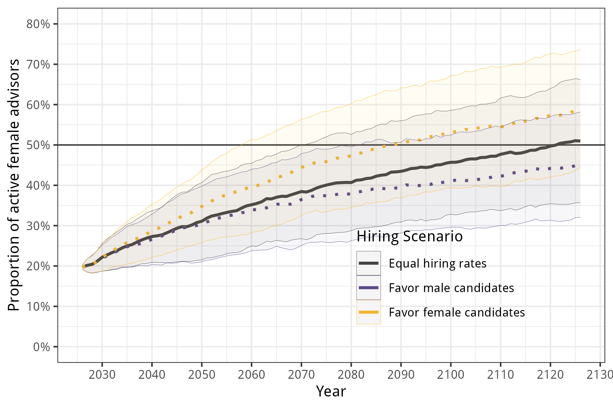{.absolute top=160 right=50 width=100% .fragment fragment-index=2}

:::

## {.split-40}

#### Intervening on Attrition + PhD Production

::: {.column}

::: {.textblock .absolute left=20 top=250 style="background-color:#5c5c5c;"}

[**No intervention**]{.alert} 

Attrition + PhD production as estimated by model. 

:::

::: {.textblock .fragment .fade-in-then-out .absolute left=20 top=250  fragment-index=1 style="background-color:#cc6d7f;"}

[**Faculty Intervention**]{.alert}

Gender parity among *current faculty* on attrition and PhD production.

:::

::: {.textblock .fragment .fade-in-then-out .absolute left=20 top=250  fragment-index=2 style="background-color:#9e8b13;"}

[**Student Intervention**]{.alert-3}

Gender parity among *future students* on attrition and PhD production.

:::

::: {.textblock .fragment .fade-in .absolute left=20 top=250  fragment-index=3 style="background-color:#159db7;"}

[**Faculty + Student Intervention**]{.alert}

Both interventions combined.

:::

:::

::: {.column}

  

{.absolute top=160 right=50 width=100%}

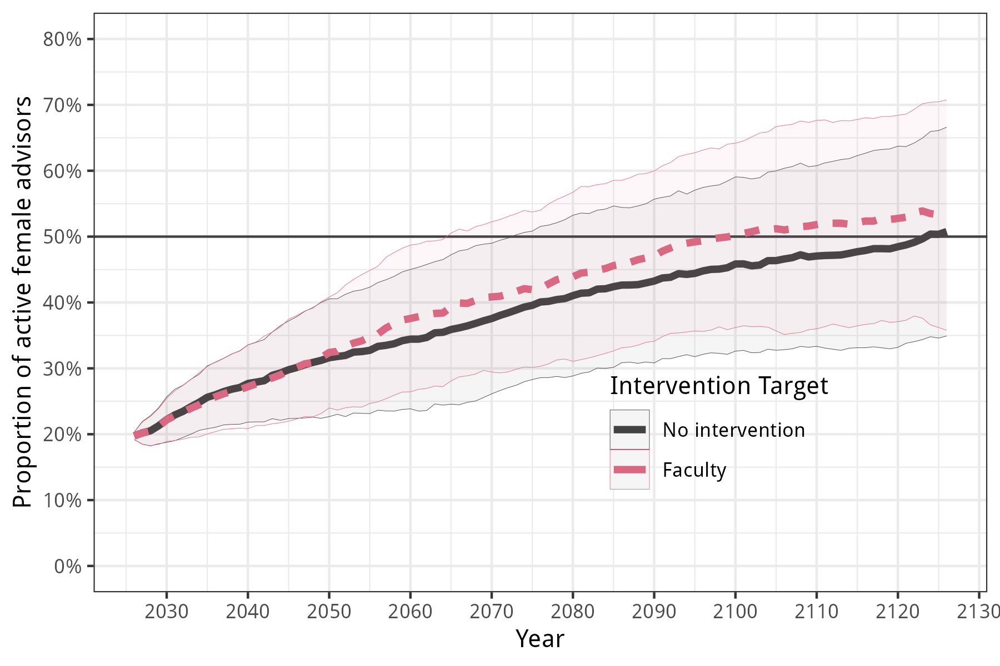{.absolute top=160 right=50 width=100% .fragment fragment-index=1}

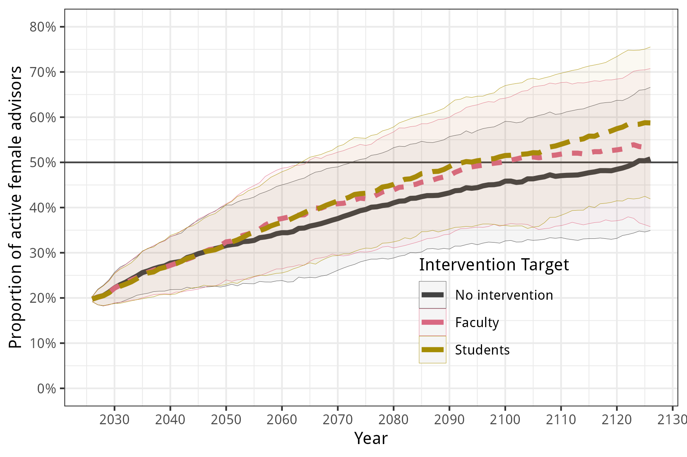{.absolute top=160 right=50 width=100% .fragment fragment-index=2}

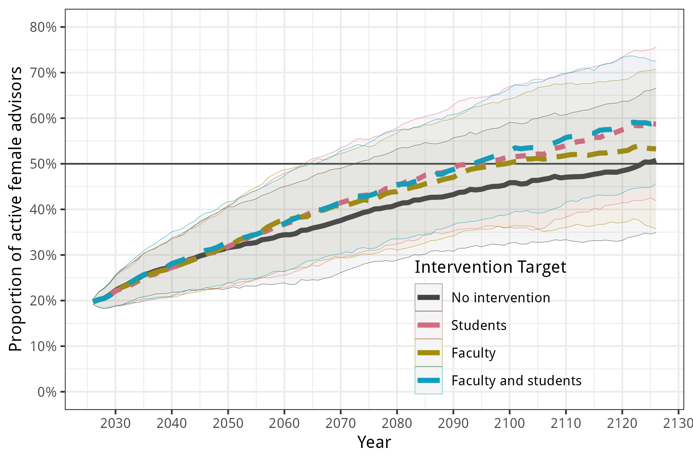{.absolute top=160 right=50 width=100% .fragment fragment-index=3}

:::

## 

### What We've Learned

<table style="width:50%;padding:0px;border-bottom:0px;margin:0px;">

<tr>
<td style="border-bottom:0px;margin:0px;">

:::{.textblock .fragment .semi-fade-out fragment-index=1 style="width:90%;"}

[**Mentorship**]{.alert}: *Female advisors are more effective in attracting or retaining female graduate students.*

:::

</td>

</tr>

<tr>
<td style="border-bottom:0px;margin:0px;">

:::{.textblock .fragment .semi-fade-out fragment-index=1 style="width:90%;"}

[**Belonging**]{.alert }: *Representation in the grad student community attracts women to programs and subfields.*

:::

</td>

</tr>

<tr>

<td style="border-bottom:0px;margin:0px;">

:::{.textblock .fragment .fade-in fragment-index=1 style="width:90%;"}
[**Attrition**]{.alert}: *Addressing disparities in career attrition for female faculty would help to close the gender gap.* 

:::
</td>

</tr>

</table>

{.absolute .fragment .fade-out fragment-index=1 top=120  width=50% left=550}

{.absolute .fragment .fade-in fragment-index=1 top=200  width=50% left=550}

## {background-image="../_img/mgp/tree.png" background-size="contain" background-position="center" background-repeat="no-repeat"}

### Next?

## 

#### Thanks everyone!

  

<table style="padding:0px;border-bottom:0pxmargin: 0px auto; ">
<tr style="border:0px;padding:0px;margin:0px;">
<td style="padding:0px;border-bottom:0px"> 
{.portrait-smaller} 
</td>
<td style="vertical-align: middle;white-space:nowrap;padding:0px;border-bottom:0px">

**Heather Brooks**   Harvey Mudd

</td>

<td style="vertical-align: middle;padding:0px;border-bottom:0px"> 
{.portrait-smaller} 
</td>
<td style="vertical-align: middle;white-space:nowrap;padding:0px;border-bottom:0px">

**Harlin Lee**   UNC Chapel Hill

</td>

<td style="vertical-align: middle;padding:0px;border-bottom:0px"> 
{.portrait-smaller} 
</td>
<td style="vertical-align: middle;white-space:nowrap;padding:0px;border-bottom:0px">

**Mason Porter**   UCLA

</td>
</tr>

<tr>

<td style="vertical-align: middle;padding:0px;border-bottom:0px"> 
{.portrait-smaller} 
</td>
<td style="vertical-align: middle;white-space:nowrap;padding:0px;border-bottom:0px">

**Juan G. Restrepo**   CU Boulder

</td>

<td style="vertical-align: middle;padding:0px;border-bottom:0px"> 
{.portrait-smaller} 
</td>
<td style="vertical-align: middle;white-space:nowrap;padding:0px;border-bottom:0px">

**Anna Haensch**   Tufts

</td>

<td style="vertical-align: middle;padding:0px;border-bottom:0px"> 
{.portrait-smaller} 
</td>
<td style="vertical-align: middle;white-space:nowrap;padding:0px;border-bottom:0px">

***Ben Brill***   *UCLA '22*

</td>

</tr>

</table>

<table>
<tr>
<td style="padding:0px;border-bottom:0px">
{.portrait-small}
</td>
<td style="vertical-align: middle;white-space:nowrap;padding:0px;border-bottom:0px">

 National Science Foundation 

</td>
<td style="padding:0px;border-bottom:0px">
{.portrait-small}
</td>
<td style="vertical-align: middle;white-space:nowrap;padding:0px;border-bottom:0px">

 ICERM \@Brown   Two summer programs!

</td>
</tr>
</table>

*Preprint coming soon* 😬😬😬

