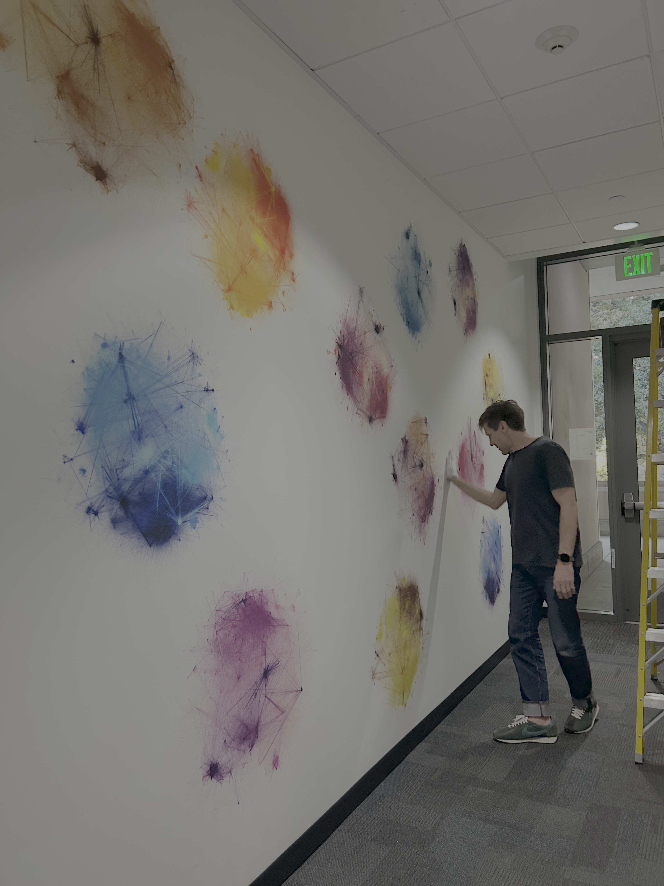

## {.split-40 background-image="../_img/midd/midd-banner-light.jpg" background-size="cover" background-position="center" background-repeat="no-repeat" background-color="white"} 

#### Hi everyone! I'm Phil Chodrow

::: {.column}

    

::: {.textblock}

Prof. of CS at Middlebury College, a small liberal arts college in Vermont.  

:::

::: {.textblock-inverse}

*Students/postdocs: ask me about [**\#LiberalArtsLife**]{.alert} if you're curious.*

:::

::: {.textblock}

I like  aikido, tea, my cats, being outside, math, and [teaching about networks]{.alert}. 

:::

:::

::: {.column}

{.absolute left=50 top=120 width=45%}
{.absolute left=50 top=400 width=45%}
{.absolute right=80 top=120 width=25.5%}
{.absolute right=80 top=250 width=25.5%}
{.absolute right=80 top=380 width=25.5%}
{.absolute right=80 top=510 width=25.5%}

::: 

## 

##### This is a story about teaching network science to undergrads at the intersection of math and computer science

- **[MATH]{.alert} 189: Network Science** by Heather Brooks at Harvey Mudd College (Fall '24) 
- **[CS]{.alert} 442: Network Science** by Phil Chodrow at Middlebury College (Spring '25) 

{.absolute left=50 top=250 width=40%}

{.absolute right=80 top=250 width=40%}

             

::: {.textblock}

Target audience: advanced undergraduates with interests/experience in **both** math and programming. 

:::

## 

### This works because of...

{.portrait-smaller .absolute width=200 height=200 left=50 top=120} 

::: {.absolute left=250 top=140 width=600}

**Heather Brooks** 
 
Harvey Mudd College
 
*Taught the course first, wrote many notes and most accompanying assignments*

:::

{.absolute width=200 height=50 left=50 top=350}

::: {.absolute left=250 top=320 width=400}
**Quarto** 
 
Open-source scientific publishing system  

:::

{.absolute width=200 height=200 left=50 top=420}  

::: {.absolute left=250 top=450 width=400}
**Google Colab**
 
Free Jupyter notebook environment in the cloud
:::

## {.split-50}

::: {.column}

#### Join me, friends

:::

::: {.column}

           

#### `https://network-science-notes.github.io/`

:::

## {.split-50}

#### Awesome student projects!

::: {.column}
  

:::

::: {.column}

        

::: {.textblock}

Network of mathematical concepts on Wikipedia by HMC students Theo Rode , Maddie Reeve, Christian Johnson, and Bea Araiza in Heather Brooks’ course MATH 189: Network Science at Harvey Mudd College.

:::
:::

## 

### Thank you everyone!

{.portrait-smaller .absolute width=200 height=200 left=50 top=120} 

::: {.absolute left=250 top=180 width=400}

**Heather Brooks** 
 
Harvey Mudd College

:::

::: {.fragment fragment-index=1}

{.absolute width=200 height=200 left=50 top=330}

:::

::: {.absolute left=250 top=350 width=400 .fragment fragment-index=1}

[**Future you**]{.alert}
 
For using, sharing, sending feedback, and contributing to the notes. 

:::

::: {.textblock .absolute left=650 top=350 width=400 .fragment}

[**You need**]{.alert}
 
Python, GitHub, Quarto

:::

                          

::: {.fragment}

#### `https://network-science-notes.github.io/`

:::